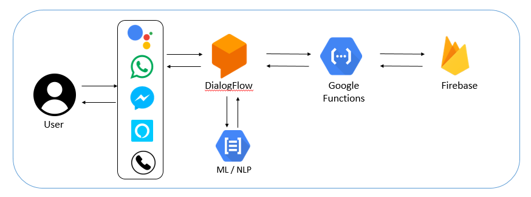

# e-सहायक 
Chatbot to give the answers based on FAQs. It can also register grievance and retrieve the status of grievance.

# Features
* Natural Language Processing based chatbot
* Can answer common questions based on FAQs
* Can register grievances from chat
* Can forward grievances to concern ministry
* Can understand and reply in हिन्दी 
* Can integrate with all social media chats plateforms like What’s App, Facebook Messanger, Twitter, Google Assistant, Alexa, SMSs, IVRs etc.
* Can integrate in any webpage
* Can integrate with existing APIs

# Architecture

# Demo
Click here to see <a href='https://youtu.be/DHcebO61oc8'>Demo</a>
